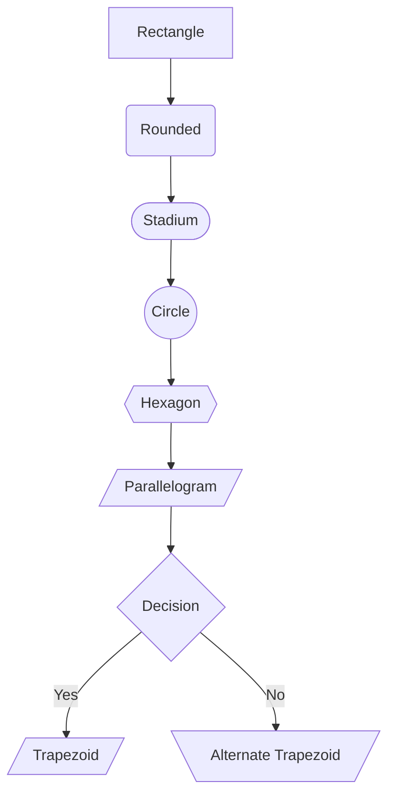
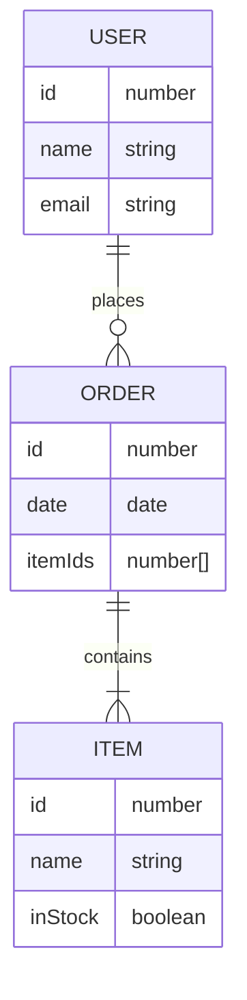
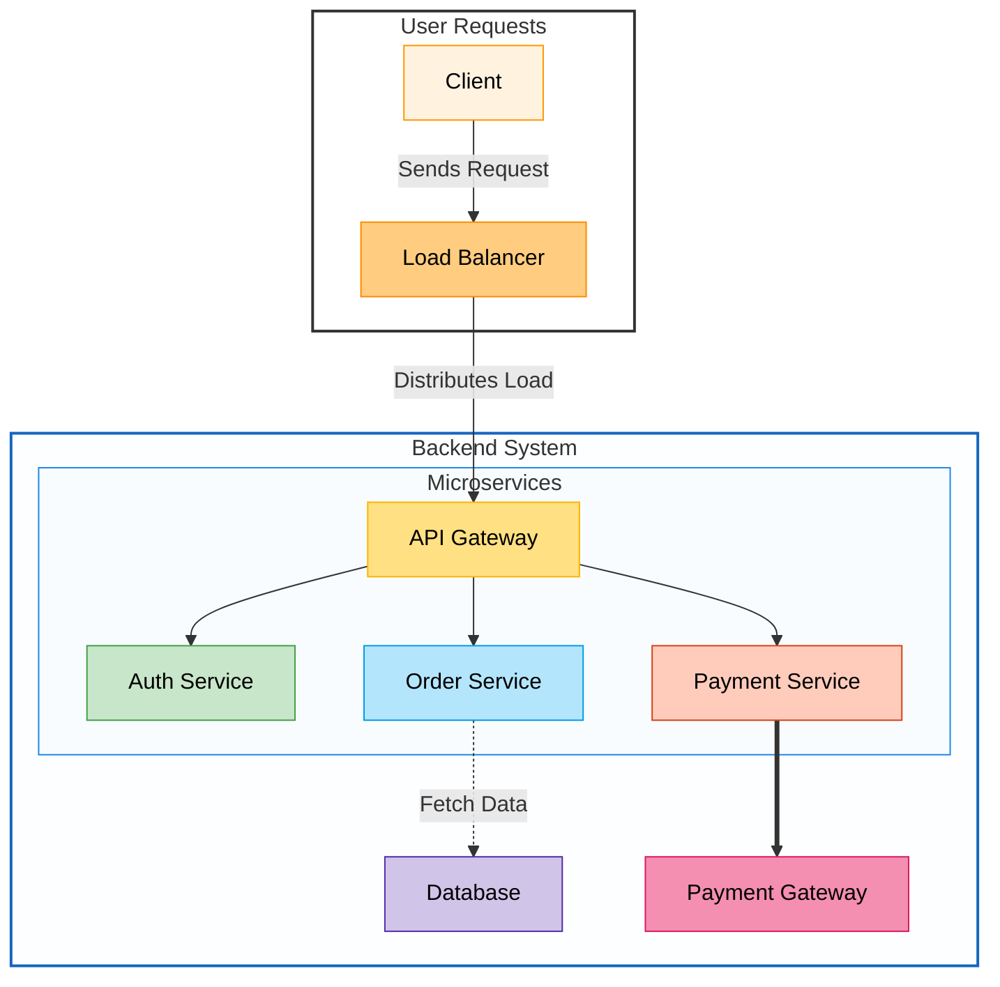
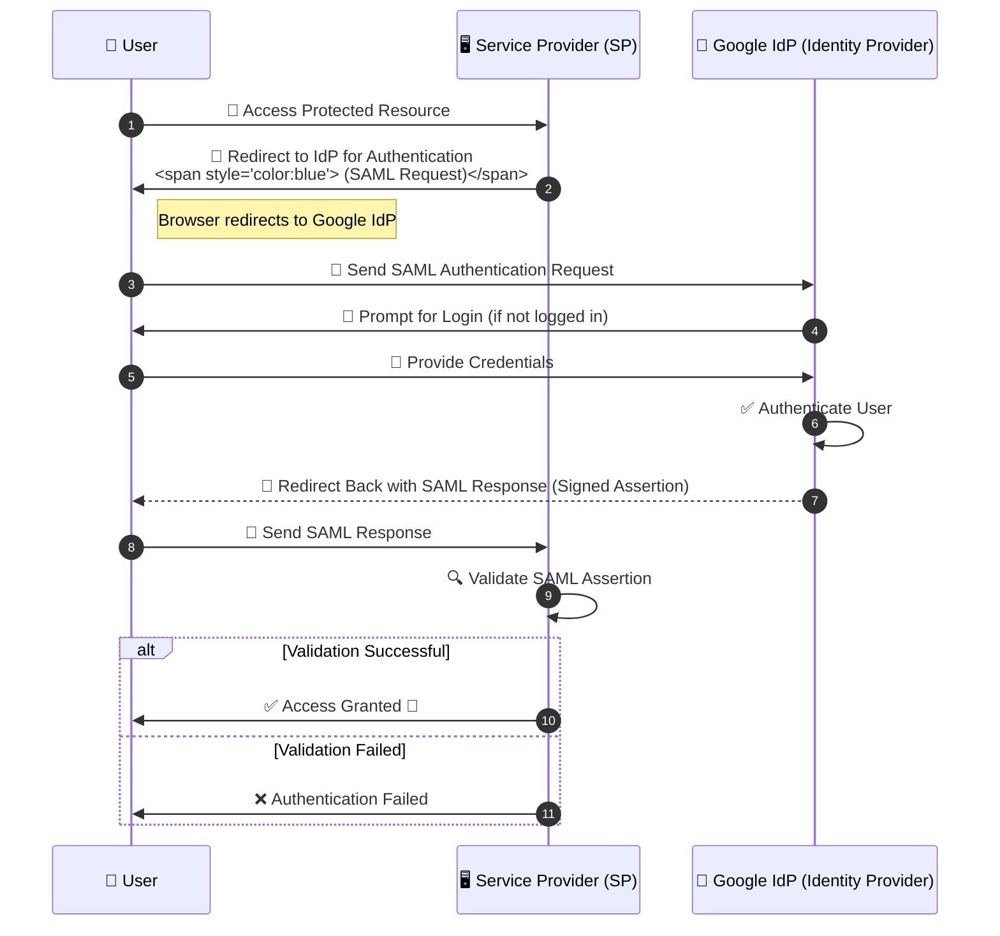
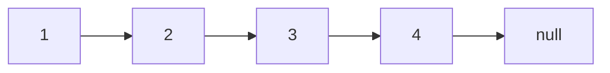
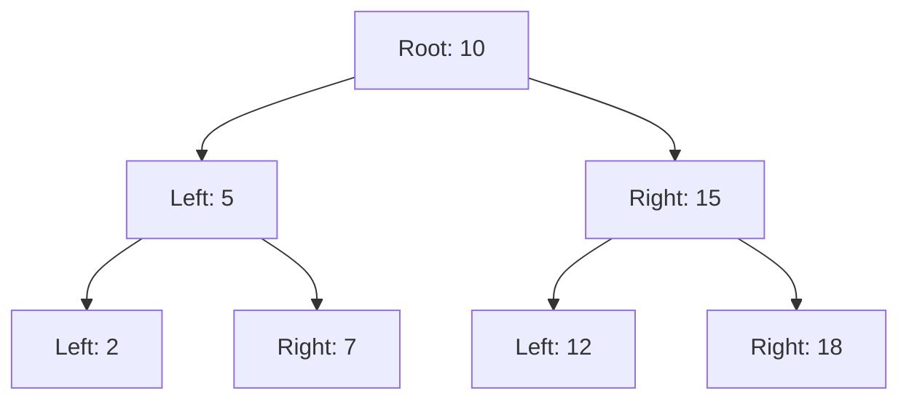
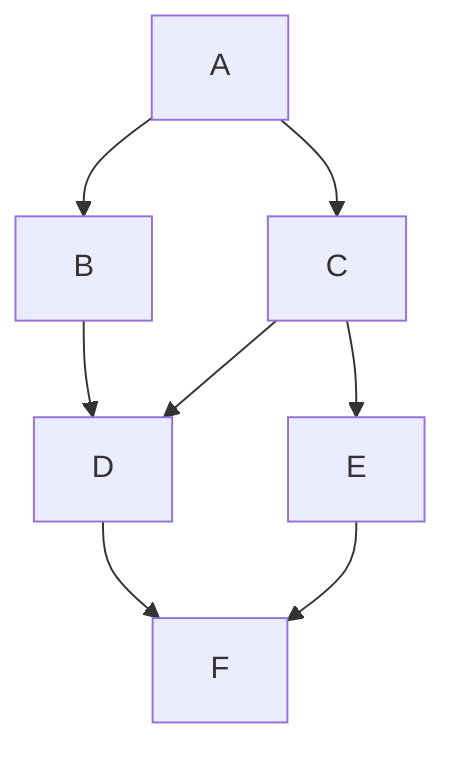

# Overview

Welcome to my collection of notes covering essential topics for software development and system design.

This GitBook serves as a structured knowledge base, helping with quick revisions and deep dives into important concepts.

## Quick Reference: Mermaid Diagrams

### Flowcharts

```
graph TD;

  A[Rectangle] --> B(Rounded)
  B --> C([Stadium])
  C --> D((Circle))
  D --> E{{Hexagon}}
  E --> F[/Parallelogram/]
  F --> G{Decision}
  G -->|Yes| H[/Trapezoid/]
  G -->|No| I[\Alternate Trapezoid/]
```




### ER Diagrams

```
erDiagram
    USER ||--o{ ORDER : places
    ORDER ||--|{ ITEM : contains


    USER {
      id number
      name string
      email string
    }

    ORDER {
      id number
      date date
      itemIds number[]
    }

    ITEM {
      id number
      name string
      inStock boolean
    }
```



### System Design Architecture



### Sequence Diagrams

```
sequenceDiagram
    autonumber

    participant User as 🧑 User
    participant SP as 🖥️ Service Provider (SP)
    participant Google as 🔐 Google IdP (Identity Provider)

    User->>SP: 🔗 Access Protected Resource
    SP->>User: 🔀 Redirect to IdP for Authentication <br> <span style="color:blue"> (SAML Request)</span>
    Note right of User: Browser redirects to Google IdP
    User->>Google: 🚀 Send SAML Authentication Request
    Google->>User: 🛑 Prompt for Login (if not logged in)
    User->>Google: 🔑 Provide Credentials
    Google->>Google: ✅ Authenticate User
    Google-->>User: 🔄 Redirect Back with SAML Response <br> <span style="color:green"> (Signed Assertion)</span>
    User->>SP: 📜 Send SAML Response
    SP->>SP: 🔍 Validate SAML Assertion
    alt Validation Successful
        SP->>User: ✅ Access Granted 🎉
    else Validation Failed
        SP->>User: ❌ Authentication Failed
    end


```



## Data Structures

### Linked List

```
graph LR
    A[1] --> B[2]
    B --> C[3]
    C --> D[4]
    D --> E[null]
```



### Binary Trees

```
graph TD
    A[Root: 10]
    A --> B[Left: 5]
    A --> C[Right: 15]
    B --> D[Left: 2]
    B --> E[Right: 7]
    C --> F[Left: 12]
    C --> G[Right: 18]
```



### Graphs



```
graph TD
    A --> B
    A --> C
    B --> D
    C --> D
    C --> E
    D --> F
    E --> F

```
