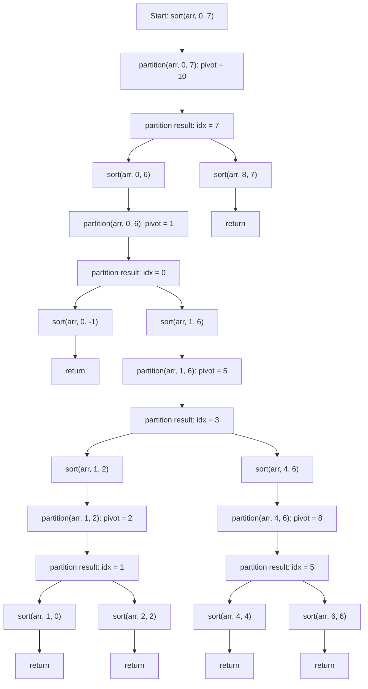
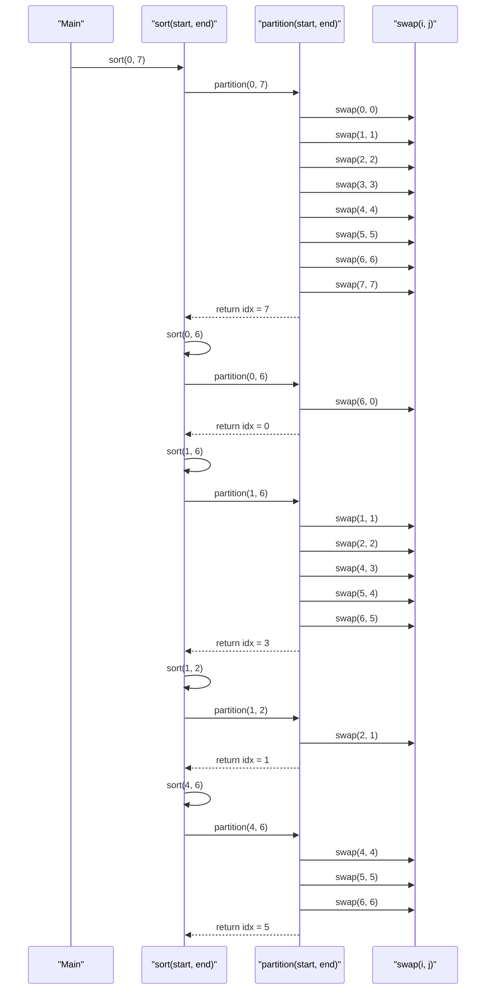

# Overview

Welcome to my collection of notes covering essential topics for software development and system design.

This GitBook serves as a structured knowledge base, helping with quick revisions and deep dives into important concepts.

[5, 3, 8, 4, 2, 7, 1, 10]

---

