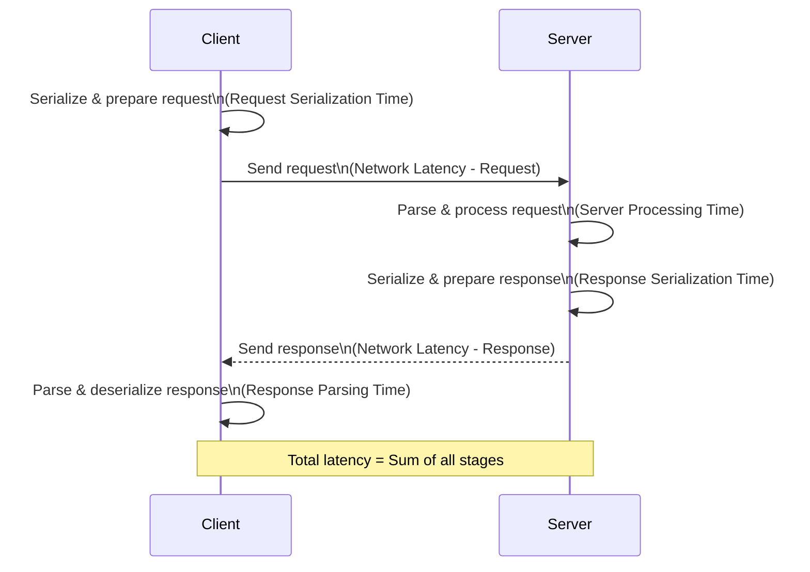

## Request Response Pattern

### What is a request

- Client Sends a request.
  - The client needs to clearly define what a request is.
- Server Parses the Request.
  - Parsing: Identifying the request type (e.g., GET, POST).
  - The backend must understand the request's boundaries (where it begins and ends) to process it correctly, especially in continuous data streams like TCP.
- Server Processes the request.
  - Serialization/Deserialization is also not cheap.
  - XML parsing is slower than JSON, which is also higher than Protocol Buffers.
- Server Sends a response.
- Client Parses the response and consume.
  - Same Parsing and Serialization/Deserialization happens here too.

### Where is Request and Response Pattern Used?

- TLDR; Everywhere.
- Web, HTTP, DNS, SSH... all use request and response for communication.
  - Web (HTTP): The core protocol for the internet.
  - DNS (Domain Name System): Resolving domain names to IP addresses.
    - Uses query IDs to match responses to requests, as multiple requests can be sent simultaneously.
- RPC (Invoking a function on a remote server and returning the data to the client.)
  - Can suffer from "leaky abstractions" where network latency becomes apparent.
- SQL and DB protocols (send a query to DB, prepares an execution plan, gets the data and returns it.)
- APIs like REST, SOAP, GraphQL (Moves the chatting between Client & Server to Application & DB in the server.)

### Request Structure

```plaintext
POST /api/endpoint HTTP/1.1
Headers
<CRLF>
Body
```

- The structure of requests and responses must be agreed upon by both client and server based on the protocol being used
  - (e.g., HTTP GET request structure: method, path, protocol version, headers).
- Libraries (e.g., HTTP libraries in Node.js Express) handle the low-level parsing for backend engineers.
- The request has a boundary that is defined by the protocol and message format (serialization/deserialization).
- Example: Image Upload using Request-Response:
  - Simple approach: Send the entire image in one go. It is Not resumable, large files can hit limits.
  - Chunked approach: Divide the image into smaller parts, send each part as a separate request with a unique identifier.
    - Resumable (if a client disconnects, it can resume from where it left off), more robust.
    - The server reassembles the chunks.

### Limitations of Request-Response

- Limitations of Request-Response:
  - Not good for notification service and chatting applications
    - Client has to constantly "poll" the server (send requests like "Do I have a notification?"), leading to:
      - High latency
      - Network congestion with many empty requests
  - Long-running requests
    - Client waits indefinitely, and if it disconnects, it loses context.
    - A better approach than Long running requests is asynchronous processing.

### Request and Response Flow

- Visualizing Request-Response Flow and Latency:

  - Client writing request: Time taken to serialize data and prepare the request.
  - Network transfer (request): Time for the request to travel across the network, including packet fragmentation, routing, and reordering at the server.
  - Server processing request: Time for the server to parse and execute the request (e.g., database queries, business logic).
  - Server writing response: Time taken to serialize data and prepare the response.
  - Network transfer (response): Time for the response to travel back to the client.
  - Client receiving/parsing response: Time for the client to receive, reorder packets, parse, and deserialize the response.
  - All these stages contribute to the overall latency of a request-response cycle.



### Curl Demo:

- Demonstrates a basic HTTP GET request.
- `curl -v --trace output.txt http://google.com` shows the request and response headers and body.
- Shows the process of TCP connection establishment, DNS lookup, sending headers (e.g., `GET / HTTP/1.1`, `Host`), and receiving response headers (e.g., `HTTP/1.1 301 Moved Permanently`) followed by the response body.

```plaintext
* IPv6: (none)
* IPv4: 142.251.223.110
*   Trying 142.251.223.110:80...
* Connected to google.com (142.251.223.110) port 80

> GET / HTTP/1.1
> Host: google.com
> User-Agent: curl/8.7.1
> Accept: */*

* Request completely sent off

< HTTP/1.1 301 Moved Permanently
< Location: http://www.google.com/
< Content-Type: text/html; charset=UTF-8
< Content-Security-Policy-Report-Only: object-src 'none';
< Date: Sat, 24 May 2025 08:54:42 GMT
< Expires: Mon, 23 Jun 2025 08:54:42 GMT
< Cache-Control: public, max-age=2592000
< Server: gws
< Content-Length: 219
< X-XSS-Protection: 0
< X-Frame-Options: SAMEORIGIN

[219 bytes data]

* Connection #0 to host google.com left intact

<HTML><HEAD><meta http-equiv="content-type" content="text/html;charset=utf-8">
<TITLE>301 Moved</TITLE></HEAD><BODY>
<H1>301 Moved</H1>
The document has moved
<A HREF="http://www.google.com/">here</A>.
</BODY></HTML>
```
