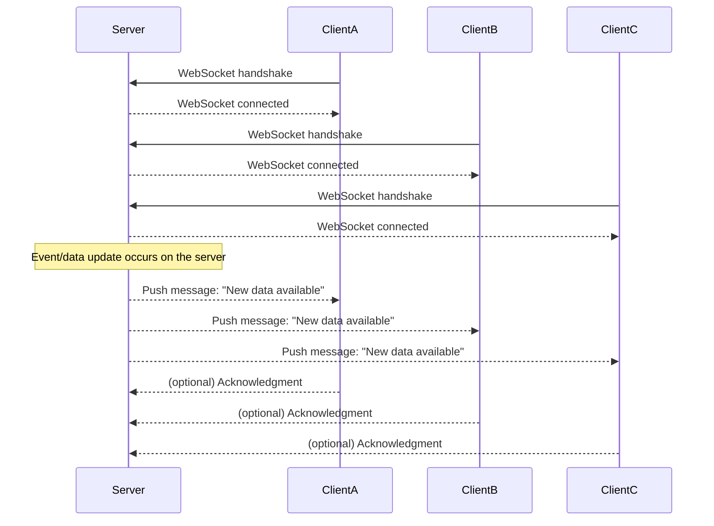

## Push

- The main idea behind push is that you send the data to all the connected clients from a centralized server as soon as possible.
- For instance, a client wants real-time notifications.

### How does push work?

1. Client makes a request to the server to initiate a connection.
2. Server establishes the connection and sends some data to the client.
3. Client doesn't have to do or request anything explicitly.
4. Can be uni-directional or bi-directional.
5. Used by Systems like RabbitMQ.

### Pros and Cons of Push

| Pros      | Cons                                        |
| --------- | ------------------------------------------- |
| Real Time | Clients must be online                      |
|           | (Usually) requires a bidirectional protocol |
|           | Clients may get overwhelmed                 |
|           | Preferable for light clients                |

### Example

Websocket server sending messages to all the connected clients in a real-time chat application.

- All clients initiate WebSocket connections with the server.
- The server maintains open connections.
- When an internal event happens (e.g., new data, message, or update), the server actively pushes the data to all connected clients.
- Acknowledgments from clients are optional and depend on implementation.
