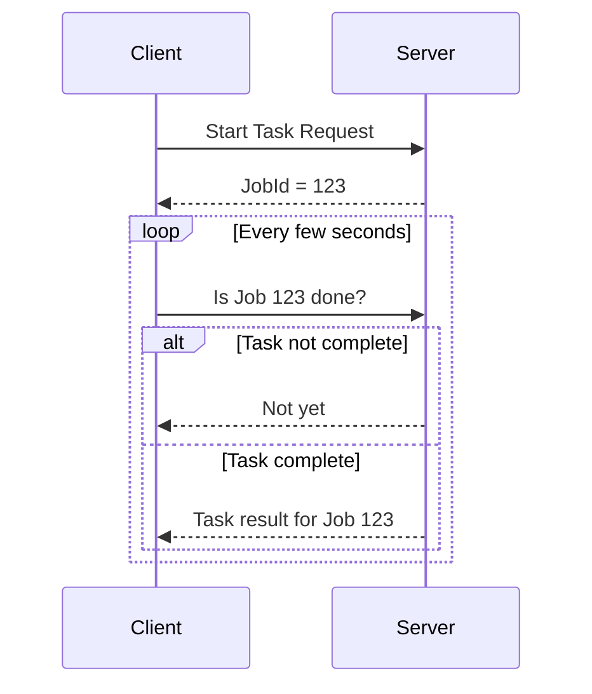
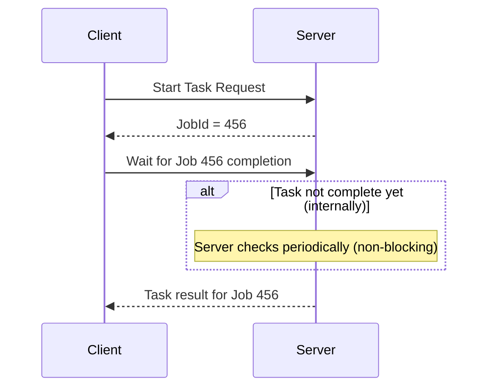

## Short Polling

- When there is a task which is taking a lot of time to complete, then the request and response model is not suitable.
- When the backend just wants to notify the user about some event happening.
- The clients can implement something like short polling.

### How does short polling work?

- Client sends a request, to which the server immediately responds back with some JobId.
- Then the client makes requests continuously at regular intervals to check if the task with the associated JobId is completed.
- Multiple short messages are exchanged until the server responds with the complete response.
- The benefit is that it is simple to implement.
- The main problem is that this method is a little bit chatty. Especially when you scale it out to more users.
  - Wastes both bandwidth and resources.

## Long Polling

- Similar to Short polling but with a difference.
- Instead of the client making multiple short requests, it makes one request for the acknowledgement.
- Subsequent request goes to the server which internally polls (in a non-blocking async way) whether the task is complete. Once the task is complete only then it responds.
- In a way the client sees the second request as a long running one.
- This allows the communication to be little less chatty and saves bandwidth.
  - Saves some bandwidth and resources comparatively.

