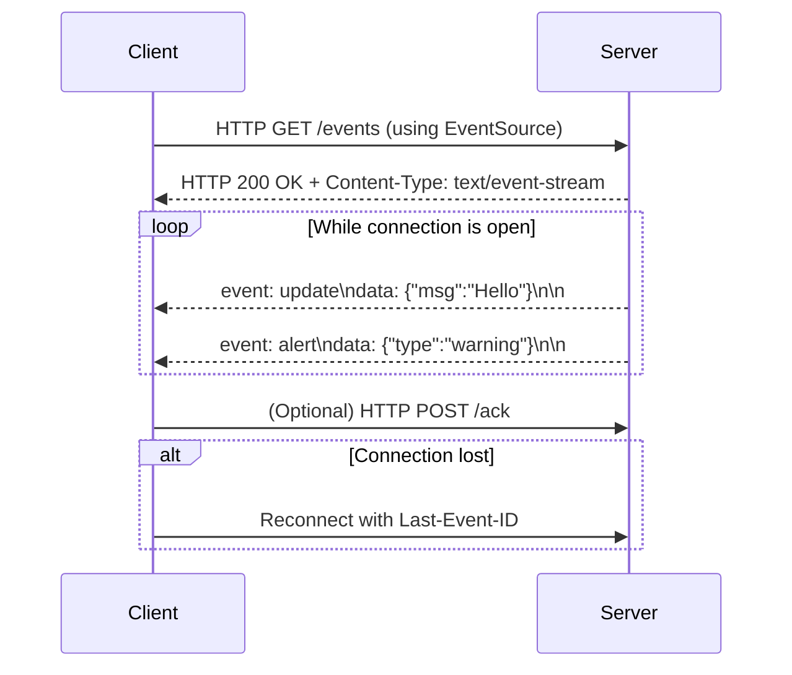

## Server Sent Events

- Vanilla Request/response isn’t ideal for notification backend if the Client wants real time notification from backend like:
  - A user just logged in
  - A message is just received
- Push works but restrictive due to overhead.
- Server Sent Events work with Request/response, Designed for HTTP and can work with any version of Vanilla HTTP.

### How it works

- The client initiates a regular HTTP request to the server using the EventSource API (typically via GET).
- The server responds with a streaming HTTP response that stays open — enabling the server to push events to the client over time.
- You only need to set the header as "Content-Type: text/event-stream" and write the response starting with the string "data: " and ending with "\n\n".
- Instead of sending a full response body, the server streams discrete "events" using a simple, line-delimited text format (event:, data:).
- The server does not close the connection, keeping it alive indefinitely to send updates as they happen.
- From the client’s perspective, it’s a single request with a never-ending response, ideal for live updates and notifications.
- The client listens for and parses incoming events from the stream, using built-in browser support (EventSource.onmessage, etc.).
- SSE operates over standard HTTP protocols, making it proxy- and firewall-friendly and simpler to integrate than WebSockets in many cases.

### Pros and Cons

| Pros                             | Cons                                                                                                                                                      |
| -------------------------------- | --------------------------------------------------------------------------------------------------------------------------------------------------------- |
| Real time                        | Clients must remain online                                                                                                                                |
| Compatible with Request/Response | Clients may get overwhelmed                                                                                                                               |
|                                  | You can only open 6 HTTP connections to a server in chrome. So If you use all 6 connections for SSE, you won't be able to fetch any JS or CSS afterwards. |
