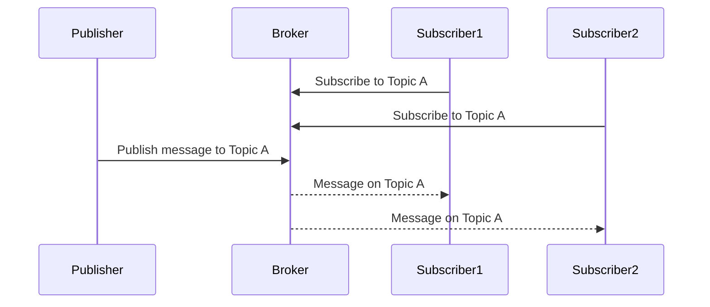

## Publish Subscribe

- You have a server which can publish to a buffer or a queue, and then move on after delivering an ACK to the client.
- Designed to solve a problem where many services need to talk to each other (creating a Mesh.)
- Whoever wants to use that data can consume from the queue. RabbitMQ uses Push, while Kafka Consumers Long Poll

### How pub sub works

### Pros and Cons of Pub/Sub

| Pros                                | Cons                                         |
| ----------------------------------- | -------------------------------------------- |
| Scales with multiple receivers      | Message Delivery Issues (2 Generals problem) |
| Great for microservices             | Complexity                                   |
| Loose Coupling                      | Network Saturation                           |
| Works while clients are not running |                                              |
