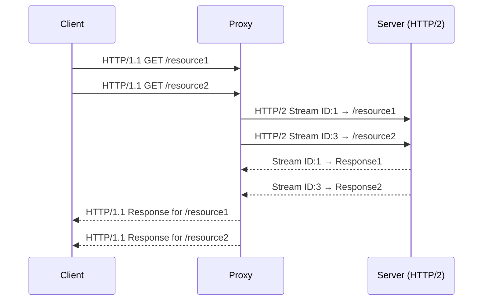
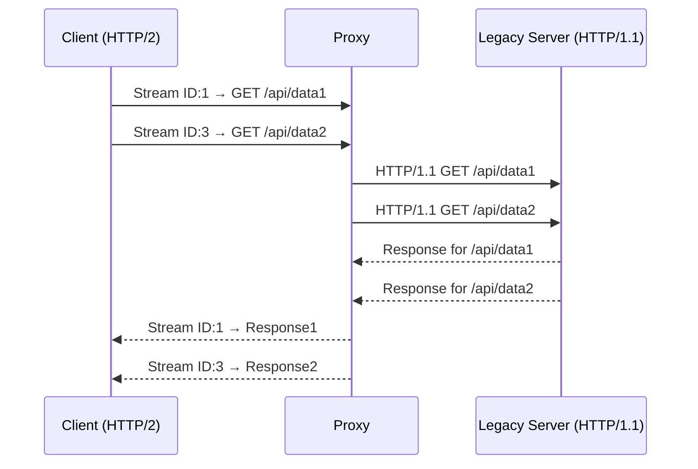

## Multiplexing

### Multiplexing Example HTTP/1.1

- If a client makes 3 HTTP requests (via fetch/axios)
- Chrome takes those multiple requests and sends them to HTTP/1.1 server individually.
- But Chrome only opens 6 HTTP/1.1 Connections, so any further requests might get stalled.

### Multiplexing Example HTTP/2

- Similarly when a client makes 3 HTTP/2 Requests
- Chrome only opens one connection to the HTTP/1.1 server.
- However that request can contain multiple requests multiplexed into one single request.

### Multiplexing and De-multiplexing on the Backend

#### Multiplexing

- Clients makes 3 HTTP/1.1 connections to the Proxy
- Proxy just converts HTTP/1.1 requests coming from the backend into HTTP/2 request to the backend server.
- The main benefit is that we have more throughput at the expense of CPU for parsing HTTP/2 requests.

#### De-multiplexing

- Frontend application makes a single HTTP/2 connection (Which has multiplexed 3 http/2 connections)
- This goes to the proxy which converts the HTTP/1.1 connection into 3 different connections.
- The benefit of this is that each of the connection has its own flow and congestion control.
  - Requires less throughput and low backend resources.

## Connection Pooling

- Client sends multiple HTTP connections for mutating something into the database.
- The backend has a connection pool of fixed size which can be used to make requests in parallel.
- If there is a connection slot free, the HTTP request is processed.
- Otherwise the request waits for the connection slot to become available.
