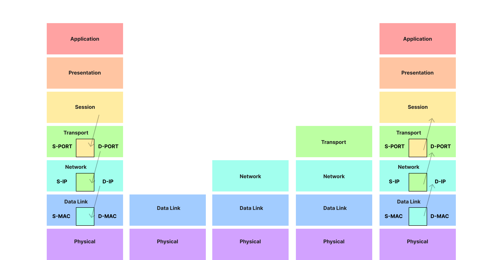

## OSI Model

- Open Systems Interconnection Model for Communication.
- Has 7 Layers for networking where each layer has a specific purpose.

### Why do we need a communication model?

#### Agnostic Applications

- Without an Open Model, Application needs understanding of the underlying system.
- Imagine an Application to have multiple versions for working with Wifi/LTE/Fiber...

#### Infrastructure management

- Upgrading networking equipment becomes complex

#### Decoupled Innovation

- New innovations can be done in each layer without affecting other layers.

### Layers of OSI

Each of the following layers describe a networking component:
| Layer | Name         | Description                                                                                                 | Example (Sender - Top to Bottom)                                                              | Example (Receiver - Bottom to Top)                                                                                                             |
| ----- | ------------ | ----------------------------------------------------------------------------------------------------------- | --------------------------------------------------------------------------------------------- | ---------------------------------------------------------------------------------------------------------------------------------------------- |
| 7     | Application  | Low Level Protocols which are used by backend libraries                                                     | POST Request with JSON data to HTTPS server.                                                  | Application understands the JSON HTTP Post request and provides it to the backend server.                                                      |
| 6     | Presentation | Encoding and serialization (Ensuring Proper data encoding like UTF)                                         | Serialize JSON into Byte Strings                                                              | Deserialize Byte strings into JSON                                                                                                             |
| 5     | Session      | This is where state is created.                                                                             | Request for establishing TCP connection / TLS                                                 | Connection is established or identified and we have completed the 3 way handshake                                                              |
| 4     | Transport    | UDP or TCP (Other protocols are built on top of these 2. You need Ports, and TCP Segments or UDP Datagrams) | Sends SYN request to target Port 443                                                          | TCP Segments assembled from Packets, For TCP, Flow/Congestion control kicks in. For SYN, we don't go up as we're still processing the request. |
| 3     | Network      | IP (There are no ports, just routing and IP Addresses. You deal with IP Packets)                            | SYN is placed in a packet and source/destination IP addresses are added after DNS resolution. | Packets are assembled using frames                                                                                                             |
| 2     | Data-link    | Deals with Frames, MAC Addresses and Ethernet.                                                              | Each packet goes into a frame and source/destination MAC address gets added.                  | Bits are converted into frames                                                                                                                 |
| 1     | Physical     | Bare Metal (How does the frame transport physically from source to destination)                             | Each frame becomes bit then becomes signal and travels through transport media.               | Signals are converted into bits                                                                                                                |

### How does OSI work in Real Life?

1. On a very high level, the request made by the client goes from the Application Layer to the physical layer, then through the physical media, from the Physical layer of the Server to the Application layer of the same.
2. On the way down, from the session layer (at client), the Session information is bundled in the Segment. Then that segment is embedded in the IP packet, which is again bundled in the data frame and then sent through the physical layer.
3. On the way up, the physical layer reads the MAC address and passes the frame to Data link layer which then extracts the IP address and passes the packet to Network layer, which extracts the destination port and then passes it to the transport layer which verifies that the session is valid.
4. Now during this transmission from the client to server, there may be switches or routers in the way. Switch only needs to identify the right device in a LAN using a MAC Address, so it only deals up-to Layer 2. Routers however need to look at the correct IP address thus, they deal with layer 3.
5. If the system architecture involves a a proxy, then depending on the complexity it might need to go all the way up to layer 4 or 7. Suppose your ISP has blocked some websites, then a Layer 4 proxy would be used. But if you're trying to access google, then they would be having a layer 7 proxy which will then redirect your request to the backend server.
