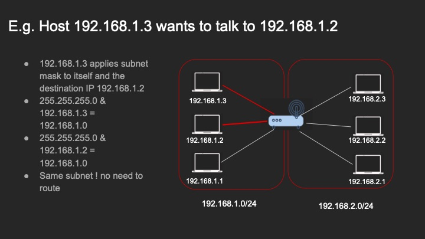
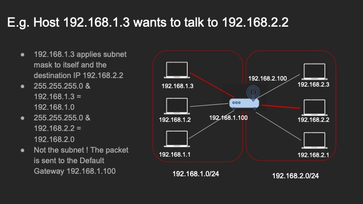
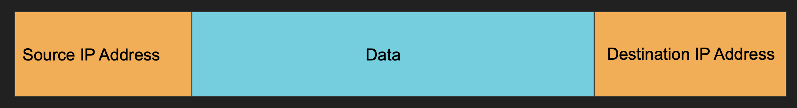
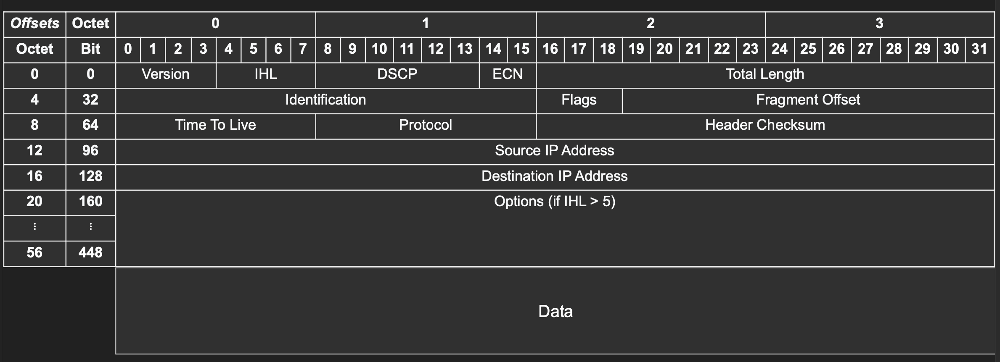
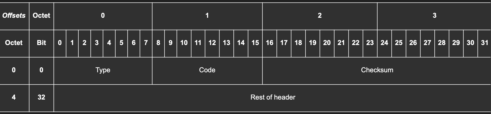
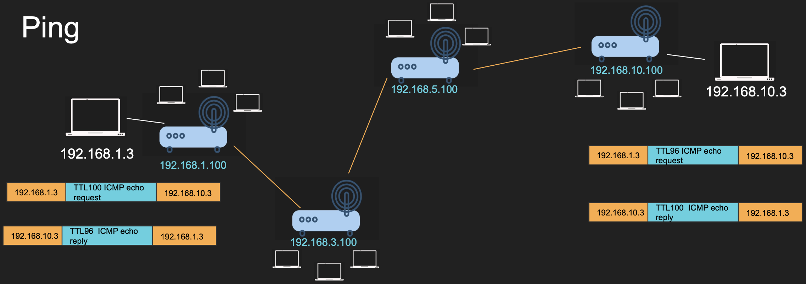
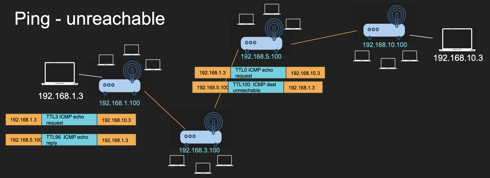

## Internet Protocol

- Any protocol regardless of what it is will eventually resolve with IP packet.
- The data (could be TCP, UDP, Redis, Postgres, GraphQL) response will be combined with IP.

### IP Building Blocks

- The IP packet is just a bunch of data with:
  1. Source IP Address
  2. Destination IP Address
  3. Headers
- IP Address is a layer 3 property.
  - Can be set automatically or statically
  - Comprises of a network and a host portion.
    - Has 4 sections (a.b.c.d/x) where x is the network bits and the remaining are the host bits.
    - Example 192.168.254.3/24 (/24 denotes that the first 24 bytes are for network and the rest 8 bits are for the host.)
    - This means that we can have 2^24 networks and each network can have 2^8 hosts.
  - Size of IPv4 is 32 Bytes

#### Subnet Mask

- 192.168.254.3/24 can also be called a subnet.
- The subnet has a mask 255.255.255.0
- Subnet Mask is used to determine whether an IP is in the same subnet.

#### Default Gateway

- Most networks contains hosts and a default gateway.
- When Host A wants to talk to Host B directly, it can do so if they're in the same subnet.
- Otherwise Host A sends it to someone who might know about the Host B called the Gateway.
- Gateway has an IP address and each host should know its gateway.

### Communication within the same subnet

- When 2 Clients in the same subnet try to talk to each other, that request is sent to the router.
- The Router (based on the subnet value) applies the subnet mask to check if both requests are in the same subnet.
- Here the two clients belong to the 192.168.1.0 subnet so router just forwards the packet to the appropriate client.

### Communication outside the subnet

- Just like before, the request is again sent to the router, which applies the subnet mask
- Now, after applying the mask the subnet IP of client 1 is 192.168.1.0 however the same or client 2 is 192.168.2.0
- This means that the request will now go to the default gateway, which allows communication outside of the networks.
- Some router will be having multiple IP Addresses for each subnet.
- Depending on what subnet the client might need to talk to, the router will route the request to the other subnet.
- Then It figures out which client to send the request to and sends it (as if the communication was taking place within the same subnet like in first scenario.)

## Anatomy of the IP Packet

- IP Packet has Headers and data sections.
- It has 20 Bytes (but can go up to 60 Bytes)
- Data section can go up to 65536 bytes.
- This is what you might think an IP Packet would look like:
  - 
- This is what an IP Packet Actually Looks Like:
  - 
  - Now, the topmost headers from 0 to 3 are bytes, beneath that are the bits.
  - On the left side, are the next bytes or bits.
  - So for instance, Version flag takes up 4 bits along with IHL in the first byte.
  - Identification takes 2 Bytes (16 bits) starting from the 32 bit or 4th byte.
  - Here you can see that options is present before data, but many routers block options since they're considered as dangerous.
- The IP Packet contains the following information:
  - Version: IP version number 4 or 6
  - IHL (Internet Header Length): Length in 32 bit words (min value 20 Bytes)
  - DSCP (Differentiated Services Code Point): For Quality of Service to classify things like VoIP and Emails and prioritize traffic.
  - ECN (Explicit Congestion Notification): Indicate network congestion ahead without dropping packets. Uses 2 bits to ensure that sender and receiver both support ECN.
    - If a router experiences congestion, it changes ECN bits to 11 and sends an ACK back to the sender. (ECN Echo)
    - The sender reducer sending rate and sets Congestion Window Reduced Flag (CWR) in next packet to acknowledge it reacted.
  - Total Length: Total size of the packet including data and headers.
  - Identification: UUID for each packet for reassembling fragmented packets.
  - Flags: Bit 0 - Reserved, Bit 1 - Don't Fragments Follow, Bit 2 - More fragments follow.
    - Fragment Offset: Where does this fragment belong in the original packet.
    - Time to Live: Packet's life (each router decrements this by 1 until it is dropped to prevent infinite looping)
      - Traceroute uses this Flag. First sends a package with TTL 1 to the first router it replies.
      - Then sends TTL 2 to the next router, and so on.
      - Repeats until the packet reaches the final destination which usually replies with ICMP Port Unreachable or TCP/UDP Response.
    - Protocol: Specifies next layer protocol (TCP/UDP)
    - Header Checksum: Error Checking Code for IP header only
    - Source IP: 32 Bit address for Sender
    - Destination IP: 32 Bit address for receiver.
    - Options: Rarely used for debugging/routing control/etc...
    - Padding: Ensure header is in the multiple of 32 bits
  - Data: Actual Payload.
- There is also something called the MTU (Max transmission unit) which defines the largest size in bytes of a packet which can be sent over a network without fragmentation.
  - Ethernet has MTU of 1500 bytes. If a packet exceeds this, it is broken into fragments unless don't fragment flag is set.
- Needless to say IP Packet has some elegant design choices:
  - Fixed Header + Optional Fields: Header is a compact 20 byte field. Which can be processed fast, IHL states where the payload starts.
  - TTL Field for avoiding routing loops and dropping packets automatically.
  - Fragmentation Support (With Identification, flags and offsets) for splitting packets too bit for the MTU.
  - Protocol Field to stack multiple protocol together enabling the layered network model.
  - Header Checksum for ensuring header integrity without touching payload.
  - QoS, Congestion Control Notifications (Backwards compatible)

## ICMP (Internet Control Message Protocol)

- Used for sending control/error/diagnostic messages between networking devices.
- Doesn't carry user data but helps routers and hosts understand and troubleshoot network conditions.
  - Host/Network Unreachable
  - TTL Expired
  - Redirection for a better route
  - Fragmentation Needed
  - Echo request/replies by Ping
  - Packet too big (Path MTU Discovery)
- This is a layer 3 protocol so it does'nt deal with Ports. It just manages/reports issues with packet delivery.
- "Internet Control" refers to the monitoring/managing/optimizing how data travels through the internet.
- ICMP Packet Format:
  - 
  - Type: What kind of message 8 Bits (0 - Echo Reply, 8 - Echo Request, 3 - Destination Unreachable)
  - Code: Subtype of the message 8 Bits  (Why unreachable: Host/Network?)
  - Checksum:  Ensures integrity of the ICMP Header and Payload 8 Bits
  - Rest of Header:  Depends on the message type - Could be ID + SEQ + MTU + Pointer, etc...
  - Data: Includes IP Header and first 8 Byte of the original packet that caused the error.
- Some routers block ICMP for reasons:
  - Attackers can use ICMP to map out network.
  - Fragmentation or timestamp based messages can be abused in smurf/ping of death
  - ICMP can cause flood attacks (DoS like ping flood/Smurf Attack)
  - Generates lots of traffic on large networks like TTL Expired messages in traceroute.

## Ping - Reachable Scenario

- The client 192.168.1.3 it trying to ping 192.168.10.3
- The message is sent through various subnets and the packet arrives at the destination.
- Since there are 4 routers in between the TTL gets decremented to 96 upon receiving.
- The destination replies with an echo reply back to the sender with a TTL of 100.
- The sender again receives the echo reply with a TTL of 96.

## Ping - Unreachable Scenario

- The client 192.168.1.3 it trying to ping 192.168.10.3
- The message is sent through various subnets and the packet is supposed to arrive at the destination.
- The sender had sent the request with a TTL of 3 which only travels up to 3 routers and the packet is dropped.
- Before dropping, the router responds with Destination Unreachable response to the sender with a TTL of 100 and the source IP of itself.
- Now, the sender has an idea that after 3 hops the request was dropped.
- This is where traceroute can help identify the path of the IP Packet.
- Since we now know the IP of the 3rd router was provided we know how far did the IP packet went. We can increase the TTL and try again later.
