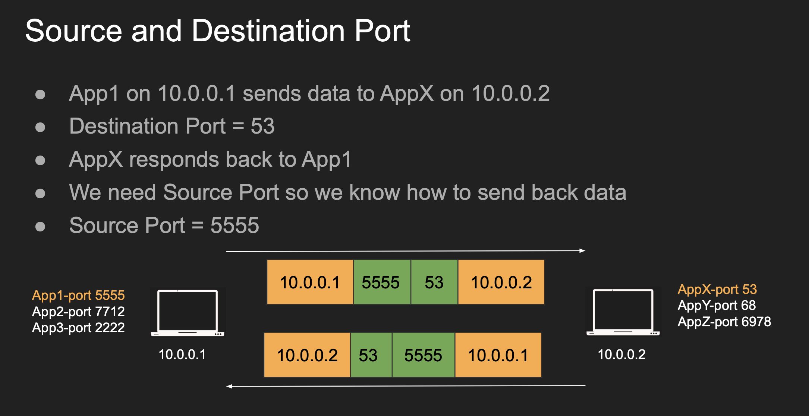
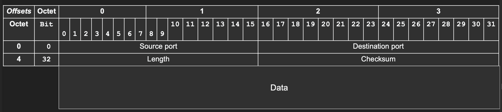

## UDP - User Datagram Protocol

- User Refers to the application level user (Not a Human) like DNS, VoIP, WebRTC, etc...
- UDP is meant to be used directly by application that want to send data without overhead of connections or guarantees
- Datagram is a self contained packet which is sent independently and might arrive out of order, be duplicated or dropped.
- This is a layer 4 Protocol which means it has access to Ports, which gives it the ability to address processes in a host.
- Prior communication is not required, and the protocol is stateless.
- Datagram header is only 8 Bytes.

### Use-Cases

- Video Streaming
    - If you want to send video, you don't care if some video frames are dropped, (might lead to some artifacts or distortions), but it's fine for the most part.
    - UDP doesn't guarantees delivery, so in this case we don't really care about 100% consistency so that makes UDP a good choice.
- VPN
    - You can't use VPN with TCP, that's just a bad idea due to TCP meltdowns.
      - A TCP Meltdown is a network performance disaster which occurs when TCP traffic is tunneled over TCP (TCP over TCP)
      - TCP Has its own retransmission, flow and congestion control mechanisms
      - If you nest one TCP connection inside another, both might react to a packet loss, but won't coordinate.
- DNS
    - When you resolve a domain like google.com, the client will send the DNS server a UDP packet to port 53.
    - Then the server will find the mapping (IP address) and respond back to the client with IP address.
    - This is because there is no handshake required, and the overhead is pretty low.
    - In very rare cases when the DNS response exceeds 512 bytes, then the DNS server might switch over to TCP to indicate Truncated flag.
- WebRTC
    - UDP is not exposed directly as a socket in the browser.
    - You either use Websockets which uses TCP or you use WebRTC to communicate between 2 peers

### Multiplexing and De-multiplexing

- In IP, only the host's IP addresses is targeted.
- But in UDP, the various application ports are also tracked.
- Each segment is going to have a source and destination port to identify the application or the process.
- Sender multiplexes all the applications to UDP and the receiver demultiplexes them into each app.



### UDP Anatomy



- Source Port: 2 Bytes - Port number of the sender
- Destination Port: 2 Bytes - Port number of the receiver
- Length: Total length of the UDP segment (Header + Data)
- Checksum: Error Checking for the header and the data combined.
- Data: Actual Payload to be sent.

### Pros and Cons

| Pros                                                                  | Cons                                             |
| --------------------------------------------------------------------- | ------------------------------------------------ |
| Stateless and Simple Protocol                                         | No Acknowledgement provided                      |
| Header Size is small so datagrams are small                           | No Guaranteed Delivery                           |
| Consumes less bandwidth                                               | Connection-less transfer without prior knowledge |
| Consumes less memory due to statelessness                             | No Flow/Congestion Control/Ordering              |
| Low Latency - No Handshake/Ordering/Retransmission/Delivery Guarantee | Security can be spoofed easily                   |

### Implementing a UDP Server from scratch in Node.js

```js
import { createSocket } from "node:dgram";

const PORT = 8080;
const IP_ADDRESS = "127.0.0.1";

// Create a UDPv4 Socket
const socket = createSocket("udp4");

// Listen to incoming requests.
socket.on("message", (message, clientInfo) => {
  // Store the current message
  const currentMessage = message.toString();

  // Print the incoming message and the client information
  console.log(`Incoming Message : ${currentMessage}`);
  console.log(`From : ${clientInfo.address}:${clientInfo.port}`);

  // Trigger a shutdown when "shutdown" is sent
  if (currentMessage.trim() === "shutdown") {
    console.log("Closing the Socket...");
    socket.close();
    return;
  }

  // Send an echo response.
  socket.send(
    `Echo From Server : ${currentMessage}`,
    clientInfo.port,
    clientInfo.address,
    (error) => {
      if (error) console.error("Could not send the message : ", error);
    }
  );
});

// Bind the port and the host to listen for messages
socket.bind(PORT, IP_ADDRESS, () => {
  console.log(`UDP server is running on : ${IP_ADDRESS}:${PORT}`);
});
```

### Implementing a UDP Server from Scratch in C++

```cpp
#include <arpa/inet.h>  // sockaddr_in(), inet_ntoa()
#include <cstring>      // memset()
#include <iostream>     // cout() and cerr()
#include <sys/socket.h> // socket(), bind(), recvfrom(), sendto()
#include <unistd.h>     // close()

/**
 * A BIT MORE ABOUT THESE IMPORTS.
 * ===============================
 * cout()        : Writing to the stdout stream
 * cerr()        : Write to stderr stream
 * memset()      : Clearing the memory
 * close()       : Closing the UDP Socket
 * sockaddr_in   : Stores the IP address, Port Number and Address Family info.
 * inet_ntoa()   : Convert binary IP addresses into readable strings.
 * inet_addr()   : Convert IP string into binary address.
 * socket()      : Create socket file descriptor (Int to track the socket).
 * bind()        : Binds the socket an IP and port to listen for messages
 * recvfrom()    : Receive incoming messages
 * sendto()      : Send messages to the client.
 */

#define SERVER_PORT 8080 // Port where the server will listen for messages
#define BUFFER_SIZE 1024 // Max size of the message buffer

/**
 * MAIN OUTLINE OF THE PROGRAM
 * ---------------------------
 * 1. create a socket file descriptor
 * 2. flush the server address struct
 * 3. re-create the server address struct
 * 4. bind the socket to the specified ip and port
 * 5. create a buffer to hold incoming messages
 * 6. Store the client's information
 * 7. run an infinite loop to continuously receive messages.
 * 8. receive data (blocking)
 * 9. print received message
 * 10. echo message back
 * 11. break out of the loop when a shutdown message arrives
 * 12. close the socket.
 */

int main() {
  // 1. create a socket file descriptor
  //   Domain - AF_INET = Addressing Family is IPv4
  //   Socket Type - SOCK_DGRAM = Use UDP as socket type
  //   Protocol - 0 = Use the default protocol for the mentioned socket type.
  int sockFd = socket(AF_INET, SOCK_DGRAM, 0);

  // Check if the socket was created properly (Shouldn't be -ve int)
  if (sockFd < 0) {
    std::cerr << "Failed to create a socket" << std::endl; // Print message.
    return 1; // Exit with non zero value to indicate error.
  }

  // 2. Create and flush the server address struct
  sockaddr_in serverAddr;                          // Create the server address
  unsigned long servAddrSize = sizeof(serverAddr); // Store server addr size
  memset(&serverAddr, 0, servAddrSize);            // Set all bytes to 0

  // 3. Re-create the server address struct
  serverAddr.sin_family = AF_INET;          // Use IPv4 Address Family
  serverAddr.sin_addr.s_addr = inet_addr("127.0.0.1");  // Listen to loopback
  serverAddr.sin_port = htons(SERVER_PORT); // Convert Port to Network Byte

  // 4. Bind the socket to the specified ip and port
  int bindResult = bind(sockFd, (sockaddr *)&serverAddr, servAddrSize);

  // If binding was unsuccessful, print to the std error stream
  if (bindResult < 0) {
    std::cerr << "Could not bind socket" << std::endl; // print the message
    return 1; // Exit with non zero code
  }

  // 5. Create a buffer to hold incoming messages
  char msgBuffer[BUFFER_SIZE];

  // 6. Store the client information
  sockaddr_in clientAddr;                   // Create a client address struct
  socklen_t clientLen = sizeof(clientAddr); // Store the length of client addr

  // Print a message on the console.
  std::cout << "UDP server started on port : " << SERVER_PORT << std::endl;

  // 7. Run an infinite loop to continuously receive messages.
  while (true) {
    // Clear the message buffer
    std::memset(msgBuffer, 0, BUFFER_SIZE);

    // 8. Receive data (blocking)
    ssize_t bytesReceived = recvfrom(sockFd, msgBuffer, BUFFER_SIZE, 0,
                                     (sockaddr *)&clientAddr, &clientLen);

    // Check if there was an error in getting the data
    if (bytesReceived < 0) {
      std::cerr << "Error receiving data..." << std::endl;
      continue;
    }

    // 9. print received message
    std::cout << "Incoming Message: " << msgBuffer;
    // Print client information
    std::cout << "From : " << inet_ntoa(clientAddr.sin_addr) << ":"
              << ntohs(clientAddr.sin_port) << "\n";

    // 10. echo message back
    sendto(sockFd, msgBuffer, bytesReceived, 0, (sockaddr *)&clientAddr,
           clientLen);

    // 11. break out of the loop when a shutdown message arrives
    if (std::strcmp(msgBuffer, "shutdown") == 0) {
      std::cout << "Shutdown command received. Exiting server.\n";
      break; // Exit the loop
    }
  }

  // 12. close the socket.
  close(sockFd);
  return 0;
}

```
