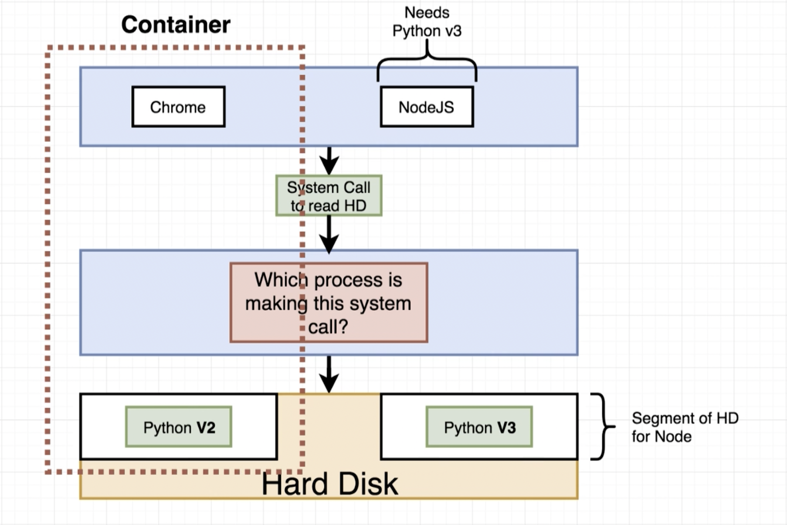

# 1. Introduction

## What is docker?
- Platform of various tools for creating and managing containers.
- Containers are created using images.
- Images: Single file containing the software, dependencies and config to run a program.
- Container is the running instance of an image.
- Container has its own isolated set of hardware resources.

## Docker Client
- Tool which provides a CLI for interacting with the docker daemon.
- Docker daemon is the tool that actually manages images and containers.
- `docker run hello-world` prints some message onto the console.
  - BTS, docker pulled the hello-world image from Docker Hub.
  - Then the Docker CLI starts up which communicates with docker server to run a program.
  - This program prints out some message to the console.
- When docker gets some command to execute some image, it first checks the docker image cache to see if it already contains the requested image.
- If not found, it will pull the image from the docker hub.
- Then the running instance of the image is created as a container.

## What's a container?
- OS has its Kernel which is a running process providing access to hardware to the software.
- Any request for accessing the hardware functionality is called a system call.
- Processes requests for these resources all the time.
- These resources can be controlled on a per-process basis using Namesapces and Cgroups.
- ### Namespaces
  - Isolating Resources per process or group of processes.
  - It means virtually segmenting an area of the hard drive.
  - We can isolate things like: Processes, Hard Drive, Network, Users, Hostnames, IPC...
- ### CGroups (Control groups)
  - Limit the amount of resources used per process.
  - Control the amount of Memory, CPU, HD I/O, Network Bandwidth...
- With all this understanding, we can finally understand that a container is essentially a vertical stack of processes, and a segment of resources using namespace with access to limited resources using CGroups.
  
- A container is going to be a sandboxed process which will interact with the kernel to get access to the resources. A portion of which will only be made available to the process.
- ### Relationship Between an Image and the Container
  - The image is the combination of 2 main things:
    1. The FS Snapshot of the software or the processes
    2. Startup commands or scripts to run
  - First a running instance of the image is created (i.e. Container)
  - Then, it is allocated limited resources by docker.
  - Then any start command is executed once the Container is up and running.
  

## How docker works?
- When Docker starts, it creates a linux VM containing the Linux Kernel
- This kernel will host the running processes inside the containers.
- The linux kernel then limits the allocation of resource and enables resource isolation.
- You can actually see that if you run `docker version` then you'd see that there is an entry for   `OS/Arch:          linux/arm64`

---
# 2. Manipulating Containers with Docker Client

## Docker Run
- Creates and runs an image. `docker run <image_name>`.
- To explicitly run some container in the background, use `docker run -d <image_name>`
- This is a combination of create & start. `docker run = docker create + docker start`.
  - ### Container Lifecycle
  - **Creating** a container: `docker create <image>`
    - This will return you the ID of the container.
  - **Starting** a container: `docker start <container id>`
    - You can use the Id of a created container to start it.
    - If you want to attach the container to the current terminal and watch for output, use the command `docker start -a <container_id>`
- Whenever we run the image, we not only get the snapshot of the image, but also we invoke the startup command.
  - ### Overriding Default Startup Command
  - This command can be overridden with a custom command by running `docker run <image> <command>`
  - One Important thing is that when you override the command and create a container, then the start command you've overridden can't be changed later. If you try to do it, docker will error out stating you can't start and attach multiple containers at once.
  - ### Listing Running Containers
  - `docker ps` lists out some information regarding the running containers such as: id, image, command, created, status, ports, & names.
  - To List out all the containers ever created on the system, use `docker ps --all`

## Docker Prune
- We can remove the following things using the `docker system prune` command:
  1. All Stopped Containers
  2. All Unused networks
  3. All Dangling Images
  4. All Build Cache

## Retrieving Log Outputs
If you forgot to add `-a` flag to attach the process to the terminal, then you can use the command `docker logs <container_id>` to see all the things that was printed out in stdout and stderr.

## Stopping Containers
There are 2 ways of stopping a docker container:
1. ### Stopping a Container
   - We can emit a SIGTERM event which can be listened for, in most of the programming languages using `docker stop <container_id>`
   - This is useful in situations where you want the underlying process to terminate gracefully.
   - If the container does not stop within 10s, then docker is automatically going to kill the container using docker kill.
2. ### Killing the Container
   - We can emit a SIGKILL event which is not handled by the process, instead we manually interrupt the process  by running `docker kill <container_id>`
   - This is useful in situations where you want the underlying process to terminate gracefully.

## Executing Commands in Running Containers
- Sometimes you might need to execute another command inside of the running container.
- You can do this using the command: `docker exec -it <container_id> <command>`
  - The `exec` command stands for execute command.
  - The `-it` flag allows us to launch an interactive session of the container.
    - The `-i` flag means attach this terminal to the stdin of the container.
    - The `-t` flag means allocating a pseudo TTY and making stuff a little pretty.

## Getting a Command Prompt in a Container
* ### Get Shell Access to Running Container
  * `docker exec -it <container_id> <sh | bash>`
* ### Starting with a Shell
  * `docker run -it <image> <sh | bash>`

---
# 3. Building Custom Images with Docker Server

## Building a Dockerfile
- A dockerfile is just a YAML file with some configurations.
- We can use it to create images
- Almost all the docker files are going to look similar; They all will have base image.
- Inside of each docker image the flow is going to be as follows:
  1. Specify Base Image
  2. Run some commands and install some programs
  3. Specify a command to run on container startup.
- Once you have created the dockerfile, go ahead and build it using the following command: `docker build <path to dockerfile> --tag <name>:<tag>`
  - Name is the name of the image
  - Tag can be any meta information you wanna put like underlying distro or optimizations.
### Example Dockerfile
```dockerfile
# Use existing docker image as base
FROM alpine

# Install some dependencies
RUN apk add --update redis

# Tell docker what to do when the image starts
CMD ["redis-server"]
```
- You can see a few things from this example
  - First word is an instruction
  - Rest is the argument to that instruction.
- A docker file is always going to have a base image, a run command to execute when the container is just started and a cmd to execute at the end.
  - These steps are similar to how you'd install some software on a machine without OS.
  - The base image is the starting point of the image which contains the OS (usually)
  - The run command which specifies commands to execute to install additional features
  - Then there is the cmd instruction which executes on container start.

## The Build Process in Detail
1. Dockerfile containing the configuration of the container is given to the docker client (CLI)
2. Then this CLI parses the configuration and hands it to the docker daemon (docker server)
3. Then the server performs the necessary steps to convert dockerfile into a usable image.
   
- When we run `docker build ./dockerfile --tag name`, docker pulls the base image first.
- Then it sends the build context (path to the dockerfile) to the daemon server.
- For each line of the dockerfile a build step is created and the hash is calculated which helps in optimizing further builds for the same images.
  
- `FROM alpine`: Docker pulls the alpine image (if not cached) and creates the first immutable layer, calculating its hash.
- `RUN apk add --update redis`: Docker starts a temporary container based on the previous layer, runs the command to install Redis, commits the filesystem changes as a new layer, and calculates its hash.
  - The temporary container is then discarded.
- `CMD ["redis-server"]`: This adds metadata to the final image, specifying the default command to run when a container starts.
  - No new layer or container is created.
- The final image consists of the layers and metadata, with a unique hash identifying it.
  
### Rebuilds with Cache
- If docker realizes that if we have 2 similar dockerfiles and one of them has an extra instruction (say after step 2) then, docker is going to use the cached version of the layer, instead of performing the mundane steps again.
- This saves a lot of time and offers performance.
- If you want to change your docker file, try to put your changes as far down as possible to save time and get more performance.
### Tagging an Image
We can name and tag the image using the following commands:
1. `docker build ./dockerfile --tag name:tag <path to use folders for build>`
2. `docker build ./dockerfile -t name:tag <path to use folders for build>`
The convention for naming your container is: `<your docker id> / <container> : <tags>`
### Manual Image Generation with Docker Commit
- We can also create an image from one of our running docker containers using the command:`docker commit -c 'CMD ["some-command"]' <containerHash> name:tag`
- This is useful if you have added something new to the existing container and want to use the new image.
---
# 4. Making Real Projects with Docker

## Container Port Mapping
- In the command line we can use `docker run -p hostPort:containerPort name:tag` to expose the container's ports to the host machine.

## Specifying a Working Directory
- We use the WORKDIR instruction to specify which directory our container should run from.
- If the directory doesn't exist previously, then it would be created and cd'd into.
```dockerfile
# Base Image
FROM node:alpine

# Change the working directory
WORKDIR /node/app

# Copy package.json from host machine to the container
COPY ./package.json ./

# Installing Dependencies
RUN rm -rf node_modules package-lock.json;
RUN npm i typescript ts-node @types/node express @types/express nodemon;
RUN npx tsc --init;

# Copy the rest of the source code from host to the container
COPY ./ ./

RUN npm ci;

# Startup Command
CMD ["npm", "run", "dev"]
```
## Unnecessary Rebuilds
- Make sure to copy the bare minimum files to install dependency and after the packages/dependencies have been installed, finally copy the source code.

---
# 5. Docker Compose - Multiple Local Containers

## Assembling a Dockerfile
```dockerfile
# Base Image
FROM node:alpine

# Choose a working directory
WORKDIR node/app

# Copy the package.json file to the working directory
COPY package.json .

# Install packages
RUN npm install;

# Copy source code from pwd of host to pwd of container.
COPY . .

# Start the program
CMD ["node", "start"]
```

## Docker Compose
- Separate CLI that gets installed alongside docker.
- Used for starting multiple docker containers at the same time.
- Automates the long args we're passing to docker run.
- To use docker compose, create a file named: `docker-compose.yaml`
- This will be used by `docker compose` CLI or `docker-compose` command.
```yaml
version: "3"
services: # List down various docker containers in the stack.
	redis-server:
		image: "redis" # Specify the image to be used from dockerhub.
	node-app:
		restart: < always | on-failure | unless-stopped | "no" >
		build: . # Build context (dockerfile) path
		ports: # Exposing port to Host
			- "3001:3000" # Host Port : container Port
```

## Networking with Docker Compose
Consider this code for creating a redis client within the docker compose with the file shown above
```ts
redis.createClient({ host: "redis-server", port: 6379 });
```
- When redis will try to make a connection request, that request will be seen by docker.
- Docker will then redirect that request to the hostname based on the name of the container.
- By Default docker will also create a virtual network and connect all the services to that network.

## Docker Compose Commands
1. Running the compose stack: `docker-compose up`
2. Run the stack in the background: `docker-compose up -d`
3. Building and running the stack: `docker-compose up --build`
4. Stop the composed stack: `docker-compose down`

## Automatic Container Restarts
- There are 2 types of status codes returned when a program crashes.
- 0 for no errors and successful exit or a positive int for signalling an error.
- We can specify a restart policy for crashed containers as the following options for `restart`
  1. `"no"`:  (notice the strings) Never try to restart the container if crashed/stopped (default)
  2. `always`: Always try to restart regardless of any condition.
  3. `on-failure`: Only restart due to non-zero status code.
  4. `unless-stopped`: Always restart unless stopped manually.

---
# 6. Creating a Production-Grade Workflow

## Flow Specifics
- The application development has 3 main stages:
  1. **Development** - Writing your code.
  2. **Testing** - Running Unit and Integration Tests.
  3. **Deployment** - Only deploying if all tests pass.
- Now, for our workflow, the diagram is going to look something like this:
  
  - Here we will push our changes to github in the feature branch (say dev/uat)
  - Then we make a pull request, review the code and then make a pull request.
  - Once the pull request is made, Travis CI will kick in, run some tests and merge with master
  - Then the code is tested again by Travis CI, and then Deployed to AWS elastic beanstalk.

## Multiple Docker Files for Dev and Prod Environment
- In the context of a node.js application we're going to run the following 3 commands:
  1. `npm run start | dev` to run the app in dev server mode
  2. `npm run test` Run any unit tests on the project
  3. `npm run build` Compile and generate optimized build of the project.
- We're going to create mutliple docker files (`dockerfile.dev` and `dockerfile`)
  - The `dockerfile.dev` will contain all the dependencies required during development.
  - The dockerfile (without suffix will be the production dockerfile with reduced dependencies
### Creating Dev Dockerfile
```dockerfile
FROM node:alpine

WORKDIR /node/app

COPY package.json ./

RUN npm i --legacy-peer-deps

COPY . .

CMD [ "npm", "start" ]
```
- We can build the image using `docker build -f dockerfile.dev . -t cra-test:latest`
- Once done, run this using the following command:
  `docker run -it --rm -p 3000:3000 -v ./:/node/app/ cra-test:latest`.
  - More about the flags used
    - `-it` : Interactive TTY mode
    - `--rm` : Delete the container when stopped
    - `-p` : map port 3000  of host with 3000 of the container
    - `-v` : Create a volume mount from the current dir to /node/app of container.

## Shorthand with Docker Compose
We don't have to write such a long command if we want to run the image, instead we could create a docker compose yaml file to create a sort of a shorthand.
```yaml
version: '3'
services:
  react-cra:
    build:
      context: .
      dockerfile: dockerfile.dev
    ports:
      - "3000:3000"
    volumes:
      - "/node/app/node_modules"
      - ".:/node/app"
    command: "npm start"
  test:
    build:
      context: .
      dockerfile: dockerfile.dev
    volumes:
      - "/node/app/node_modules"
      - ".:/node/app"
    command: "npm test"
```
#### Do We Need Copy the files in both dockerfile and docker-compose.yaml?
- Now, we're explicitly telling docker to do some things which might seem redundant.
  1. We're telling the docker-compose utility to create a volume bind.
  2. We're also telling docker using the dockerfile to copy all the files from the dir specified.
- In docker, a volume bind takes precedence over COPY instructions.
- So the best practice is to leave the COPY instruction in the dockerfile for situations where you want to make the image self contained.

## Executing Tests
- There are couple of approaches for executing tests in the container.
  1. We can attach to the running container with its id or name
     1. `docker compose ps` to list out all running containers
     2. `docker exec -it <name|id> <test command>`
     - This approach requires you to cd to the build context then execute docker compose ps and then get the id of the container and then execute the tests with a long command.
  2. We can create a whole new service in the docker-compose.yaml file for
     - This will ensure whenever we add new tests to the project they'll get executed. But we still don't have any way of interacting with stdin for providing patterns.

## Need for Nginx
- When we build the project and get the dist folder with the output html, css and js files, we require a server to serve those files to users on the internet.
- For that reason we need some server like Nginx which takes all those files and serves them.

## Multi-Step Docker Builds

- For building and serving our application we need to divide the process into 2 phases
- Build phase will just install the required dependencies and run npm run build
  - It will then generate some files as output.
- Then we'll use Nginx, copy over the built output from the previous step and start nginx with our files.

## Implementing Multi-Step Builds
- When we specify a FROM instruction, Docker interprets it as the start of a new phase.
- We can also assign some alias to the build stage.
- Also we can copy the output from the build phase to the serve stage.
- Also when we use FROM nginx as image, it contains the default nginx command to run nginx.
```dockerfile
# Build Stage
FROM node:alpine as build
WORKDIR /node/app
COPY package.json ./
RUN npm i --legacy-peer-deps
COPY . .
RUN npm run build

# Serve Stage
FROM nginx:latest
COPY --from=build /node/app/dist /usr/share/nginx/html
```
- Now we need to create the build using `docker build . -t cra:prod`

## Running Nginx
- We just need to run the built image using `docker run -p 8080:80 <container id>`

---
# 7. CI and Deployment with AWS

## Github Setup

## Travis CI Setup

## Travis YML File Configuration

## A Touch More Travis Setup

## Automatic Build Creation

## AWS Elastic Beanstalk

## More on Elastic Beanstalk

## Travis Config for Deployment

## Automated Deployments

## Exposing Ports Through the Dockerfile

## Workflow With Github

## Redeploy on Pull Request Merge

## Deployment Wrapup

---
# 8. Building a Multi-Container Application

## Application Overview

## Application Architecture

## Worker Process Setup

## Express API Setup

## Connecting to Postgres

## More Express API Setup

## Generating the React App

## Fetching Data in the React App

## Rendering Logic in the App

## Exporting the Fib Class

## Routing in the React App

---
# 9. `_Dockerizing_` Multiple Services

## Dockerizing a React App - Again!

## Dockerizing Generic Node Apps

## Adding Postgres as a Service

## Docker-compose Config

## Environment Variables with Docker Compose

## The Worker and Client Services

## Nginx Path Routing

## Routing with Nginx

## Building a Custom Nginx Image

## Starting Up Docker Compose

## Troubleshooting Startup Bugs

## Opening Websocket Connections

---
# 10. A CI Workflow for Multiple Images
## Production Multi-Container Deployments
## Production Dockerfiles
## Multiple Nginx Instances
## Altering Nginx's Listen Port
## Cleaning Up Tests
## Github and Travis CI Setup
## Travis Configuration Setup
## Pushing Images to Docker Hub
## Successful Image Building

---
# 11. Multi-Container Deployments to AWS
## Multi-Container Definition Files
## Finding Docs on Container Definitions
## Adding Container Definitions to DockerRun
## More Container Definitions
## Forming Container Links
## Creating the EB Environment
## Managed Data Service Providers
## Overview of AWS VPC's and Security Groups
## RDS Database Creation
## ElastiCache Redis Creation
## Creating a Custom Security Group
## Applying Security Groups to Resources
## Setting Environment Variables
## IAM Keys for Deployment
## Travis Deploy Script
## Container Memory Allocations
## Verifying Deployment
## A Quick App Change
## Making Changes
## Cleaning Up AWS Resources
---
# 12. Onwards to Kubernetes!
## The Why's and What's of Kubernetes
## Kubernetes in Development and Production
## Minikube Setup on MacOS
## Mapping Existing Knowledge
## Adding Configuration Files
## Object Types and API Versions
## Running Containers in Pods
## Service Config Files in Depth
## Connecting to Running Containers
## The Entire Deployment Flow
## Imperative vs Declarative Deployments

---
# 13. Maintaining Container Sets & Deployments
## Updating Existing Objects
## Declarative Updates in Action
## Limitations in Config Updates
## Running Containers with Deployments
## Deployment Configuration Files
## Walking Through the Deployment Config
## Applying a Deployment
## Why Use Services_
## Scaling and Changing Deployments
## Updating Deployment Images
## Rebuilding the Client Image
## Triggering Deployment Updates
## Imperatively Updating a Deployment's Image
## Multiple Docker Installations
## Reconfiguring Docker CLI
## Why Mess with Docker in the Node_

---
# 14. A Multi-Container App with Kubernetes
## The Path to Production
## A Quick Checkpoint
## Recreating the Deployment
## NodePort vs ClusterIP Services
## The ClusterIP Config
## Applying Multiple Files with Kubectl
## Express API Deployment Config
## Cluster IP for the Express API
## Combining Config Into Single Files
## The Worker Deployment
## Reapplying a Batch of Config Files
## Creating and Applying Redis Config
## Last Set of Boring Config!
## The Need for Volumes with Databases
## Kubernetes Volumes
## Volumes vs Persistent Volumes
## Persistent Volumes vs Persistent Volume Claims
## Claim Config Files
## Persistent Volume Access Modes
## Where Does Kubernetes Allocate Persistent Volumes_
## Designating a PVC in a Pod Template
## Applying a PVC
## Defining Environment Variables
## Adding Environment Variables to Config
## Creating an Encoded Secret
## Passing Secrets as Environment Variables
## Environment Variables as Strings

---
# 15. Handling Traffic with Ingress Controllers
## Load Balancer Services
## A Quick Note on Ingresses
## One Other Quick Note!
## Behind the Scenes of Ingress
## More Behind the Scenes of Ingress
## Setting up Ingress Locally with Minikube
## Creating the Ingress Configuration
## Testing Ingress Locally
## The Minikube Dashboard

---
# 16. Kubernetes Production Deployment
## The Deployment Process
## Google Cloud vs AWS for Kubernetes
## Creating a Git Repo
## Linking the Github Repo to Travis
## Creating a Google Cloud Project
## Linking a Billing Account
## Kubernetes Engine Init
## Creating a Cluster with Google Cloud
## Kubernetes Dashboard on Google Cloud
## Travis Deployment Overview
## Installing the Google Cloud SDK
## Generating a Service Account
## Running Travis CLI in a Container
## Encrypting a Service Account File
## More Google Cloud CLI Config
## Running Tests with Travis
## Custom Deployment Providers
## Unique Deployment Images
## Unique Tags for Built Images
## Updating the Deployment Script
## Configuring the GCloud CLI on Cloud Console
## Creating a Secret on Google Cloud
## Helm Setup
## Kubernetes Security with RBAC
## Assigning Tiller a Service Account
## Ingress-Nginx with Helm
## The Result of Ingress-Nginx
## Finally - Deployment!
## Did I Really Type That_
## Verifying Deployment
## A Workflow for Changing in Prod
## Merging a PR for Deployment
## That's It!  What's Next_
---
# 17. HTTPS Setup with Kubernetes
## HTTPS Setup Overview
## Domain Purchase
## Domain Name Setup
## Cert Manager Install
## How to Wire Up Cert Manager
## Issuer Config File
## Certificate Config File
## Deploying Changes
## Verifying the Certificate
## Ingress Config for HTTPS
## It Worked!
---
# 18. Local Development with Skaffold
## Awkward Local Development
## Installing Skaffold
## The Skaffold Config File
## Live Sync Changes
## Automatic Shutdown
## Testing Live Sync with the API Server
