# Big O Notation

## What is it?

- Mathematical representation of upper-bound/worst-case scenario of algorithm.
- Describes how the computation or memory requirements grow based on input size.

## What is it not?

- An exact measurement of algorithm's performance.
- Tied to specific hardware or programming language.
- Description of best or average case.

## What other notations are there?

1. Big Omega: Best case or Lower Bound
2. Big Theta: Average Case or Tight Bound
3. Little O: Looser Upper Bound (Slightly Better)
4. Little Omega: Looser Lower Bound (Slightly Worse)

## Why do we only care about Big O?

- Worst-case performance is the most critical in real-world applications.
- It helps in making decisions about algorithm efficiency when scaling.
- It provides a universal standard for comparing algorithms.

## How to measure Big O Notation

1. Drop Insignificant Terms.
2. Drop Constants.
3. Always look at the worst case scenario.

`O(n^2) + O(3n) => O(n^2)`

## Common Big O Notations

| Notation   | Name        | Explanation                                                         |
| ---------- | ----------- | ------------------------------------------------------------------- |
| O(n!)      | Factorial   | Completely impractical for large N (brute-force traveling salesman) |
| O(2^n)     | Exponential | Doubles with each additional element (Naive Recursive algorithms)   |
| O(n^c)     | Polynomial  | Commonly seen in nested loops                                       |
| O(n log n) | Quasilinear | Found in efficient sorting algorithms (Merge/QuickSort)             |
| O(n)       | Linear      | Scales Linearly (Iterating over array elements)                     |
| O(sqrt n)  | Sublinear   | Jump traversals.                                                    |
| O(log n)   | Logarithmic | Divide & Conquer algorithms like binary search.                     |
| O(1)       | Constant    | Best Case                                                           |

```mermaid
graph TD;
    O1["O(1) - Constant Time 🚀"] --> Ologn["O(log n) - Logarithmic 🔍"]
    Ologn --> Osqrtn["O(√n) - Sublinear ⏳"]
    Osqrtn --> On["O(n) - Linear 📈"]
    On --> Onlogn["O(n log n) - Quasilinear 🔄"]
    Onlogn --> Onc["O(n^c) - Polynomial 🎭"]
    Onc --> O2n["O(2^n) - Exponential 💥"]
    O2n --> Onf["O(n!) - Factorial 🛑"]

    style O1 fill:#4CAF50,stroke:#2E7D32,stroke-width:2px;
    style Ologn fill:#8BC34A,stroke:#558B2F,stroke-width:2px;
    style Osqrtn fill:#FFEB3B,stroke:#FBC02D,stroke-width:2px;
    style On fill:#FFC107,stroke:#FFA000,stroke-width:2px;
    style Onlogn fill:#FF9800,stroke:#F57C00,stroke-width:2px;
    style Onc fill:#FF5722,stroke:#E64A19,stroke-width:2px;
    style O2n fill:#F44336,stroke:#D32F2F,stroke-width:2px;
    style Onf fill:#B71C1C,stroke:#880E4F,stroke-width:2px;

```

