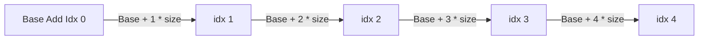

# Primitive Arrays

- Contiguous block of memory which stores multiple items of the same type.
- Unlike dynamic data structures, this provides lookups in O(1) by direct memory addressing.

## How it works at a lower level

1. **Memory Allocation**

   - System allocates a contiguous block of memory for the array.
   - Each elements is stored next to each other in memory.
   - The size of the array is determined at creation and can't be changed later.

2. **Indexing and Address Calculation**

   - Memory address calculation => Base Address + (Idx \* Type size)
   - Since this calculation is constant, lookups are also constant.

3. **Cache Efficiency**

   - Arrays are stored sequentially making them cache friendly.
   - CPUs prefetch upcoming elements, improving performance.

## Trivia

1. Why arrays are indexed from 0?

   - Base address calculation becomes trivial as we don't have to multiply if we're accessing 1st element.
   - If 1 or -1 indexing was used, extra subtraction or addition will have an overhead.

2. What happens when you access something out of bounds

   - Buffer overflow or memory corruption.

3. Why can't arrays be resized?

   - Since arrays allocate a fixed contiguous block of memory, resizing would require:
     - Allocating a new larger array.
     - Copying all elements over (O(n) time complexity).
     - Deallocating the old array.

## Pros and Cons

### Pros

- Fast Access (O(1)) – Direct indexing provides constant-time access.
- Memory Efficiency – No extra memory is needed for metadata like in linked lists.
- Cache Friendly – Due to contiguous allocation, data locality improves performance.

### Cons

- Fixed Size – Cannot be resized dynamically.
- Insertion & Deletion are Costly – Elements need to be shifted.
- Wastage of Memory – If over-allocated, unused space is wasted.

## Time Complexity of Various Operations

| Operation              | Time Complexity | Space Complexity |
| ---------------------- | --------------- | ---------------- |
| Access (arr[i])        | O(1)            | O(1)             |
| Search (Linear Search) | O(n)            | O(1)             |
| Insert at end          | O(1)            | O(1)             |
| Insert at beginning    | O(n)            | O(1)             |
| Insert at middle       | O(n)            | O(1)             |
| Delete at end          | O(1)            | O(1)             |
| Delete at beginning    | O(n)            | O(1)             |
| Delete at middle       | O(n)            | O(1)             |

## Array in Memory

