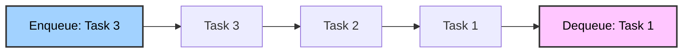

## What are Queues?

- Another node based data structure
- Artificially constrained to perform better in certain conditions.
- First in First Out (FIFO)
- Usually Implemented using a linked list.
- Contains a head and a tail pointer.
- Insertions happen at the tail end and removal happens at the head.



| Operation  | Description                                       | Time Complexity | Space Complexity |
| ---------- | ------------------------------------------------- | --------------- | ---------------- |
| Enqueue    | Adds an element to the end of the queue           | O(1)            | O(1)             |
| Dequeue    | Removes an element from the front of the queue    | O(1)            | O(1)             |
| Peek/Front | Returns the element at the front without removing | O(1)            | O(1)             |
| isEmpty    | Checks if the queue is empty                      | O(1)            | O(1)             |

## Implementation of a Queue

```java
package queue;

/* -------------------------------------------------------------------------- */
/*                         A Single Node for the Queue                        */
/* -------------------------------------------------------------------------- */
class Node<T> {
  public T value;
  public Node<T> next;

  public Node(T value) {
    this.value = value;
  }
}

/* -------------------------------------------------------------------------- */
/* Actual Queue Itself */
/* -------------------------------------------------------------------------- */
public class Queue<T> {
  /* ---------------------- Just for bookkeeping stuff... --------------------- */
  int length;
  Node<T> head;
  Node<T> tail;

  /* ------------------------------- Constructor ------------------------------ */
  public Queue() {
    length = 0;
    head = tail = null;
  }

  /* -------------------- Return the value set for deletion ------------------- */
  T peek() {
    // If the head is not present, then you can't peek.
    if (head == null) {
      return null;
    }
    // Return the value to be deleted without deleting it.
    return head.value;
  }

  /* ------------------------ Add an item to the queue ------------------------ */
  void enqueue(T value) {
    // Create a new node.
    Node<T> newNode = new Node<T>(value);

    // Check if there is a node in the queue.
    if (tail == null) {
      tail = head = newNode; // Create a new node.
    } else {
      tail.next = newNode; // Move tail behind the new node.
      tail = newNode; // Update the tail reference.
    }

    // Increment the value.
    length++;
  }

  /* ---------------------- Remove an item from the queue --------------------- */
  T dequeue() {
    // If there is nothing in the queue, return null.
    if (head == null) {
      return null;
    }

    // If there is something in the queue, make sure head moves ahead.
    else {
      T value = head.value; // Store the value in a temp for returning.
      head.value = null; // Unset the head node's value.
      head = head.next; // Move head ahead.

      // If the head becomes null, then the queue is empty
      if (head == null) {
        head = tail = null;
      }

      length--; // Decrease the length after removing a value from the queue.
      return value; // Return the value
    }
  }
}
```

## Kinds of Queues

| Queue Type                            | Description                                                    | Real-World Applications (Frontend/Backend)                        |
| ------------------------------------- | -------------------------------------------------------------- | ----------------------------------------------------------------- |
| 1. Simple Queue                       | FIFO (First-In-First-Out): Enqueue at rear, dequeue from front | Request scheduling, task runners, printer queues                  |
| 2. Circular Queue                     | Last position is connected back to the first to form a circle  | Buffering data (e.g. audio/video streams, ring buffers)           |
| 3. Priority Queue                     | Elements are dequeued based on priority, not order             | Job scheduling (CPU/Thread pools), task urgency in workflows      |
| 4. Deque (Double-Ended Queue)         | Insert and remove from both ends                               | Undo/redo operations, palindromic checks, sliding window problems |
| 5. Blocking Queue                     | Thread-safe queue that blocks on empty/full                    | Producer-consumer patterns, async pipelines                       |
| 6. Concurrent / Thread-safe Queue     | Allows multiple threads safely                                 | Web servers, microservices communication, thread pools            |
| 7. Monotonic Queue                    | Maintains elements in increasing or decreasing order           | Sliding window max/min, optimizations in DSA problems             |
| 8. Double-Ended Priority Queue (DEPQ) | Combination of deque + priority queue                          | Real-time scheduling, financial order books                       |
| 9. Message Queue (MQ)                 | Distributed queue used for inter-service communication         | RabbitMQ, Kafka, AWS SQS – async communication in microservices   |
