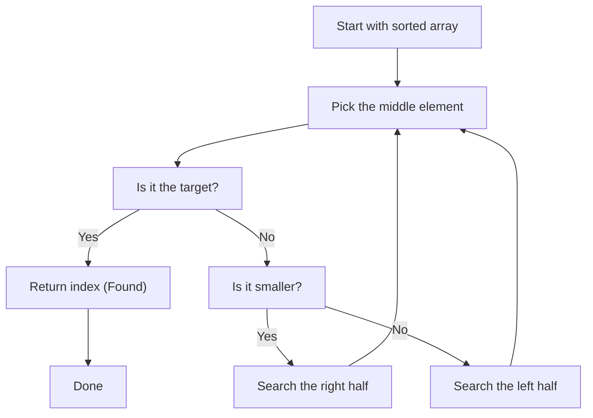

# Search Algorithms (For linear data structures)

## Linear Search (Brute Force)

- Simplest and oldest search algorithms.
- Best for small data.
- Works without preprocessing.
- Used in Garbage Collectors to find objects marked for GC.

| Time Complexity | Best Case             | Worst Case                   | Usage          |
| --------------- | --------------------- | ---------------------------- | -------------- |
| O(N)            | O(1) if item at start | O(N) if item at end / absent | Unsorted Lists |

### Implementation

```java
class LinearSearch {
  public static boolean search(int arr[], int value) {
    for (int i = 0; i < arr.length; i++) {
      if (arr[i] == value)
        return true;
    }
    return false;
  }
}
```


## Jump Search (Sublinear)

- More efficient than linear search (if we have sorted array).

### Implementation

```java
public class JumpSearch {
  public static int search(int[] arr, int needle) {
    int jumpAmount = (int) Math.sqrt(arr.length);
    int i = 0;

    // Find the correct block
    for (; i < arr.length; i += jumpAmount) {
      if (arr[i] >= needle) {
        break;
      }
    }

    // Include i (prevent off by one)
    int blockEnd = Math.min(arr.length, i + 1);

    // For loop for the next block.
    for (int j = Math.max(0, i - jumpAmount); j < blockEnd; j++) {
      if (arr[j] == needle)
        return j;
    }

    return -1;
  }
}

```


## Binary Search (Divide & Conquer)

- One of the first divide and conquer algorithms.
- Efficient for sorted lists.

| Time Complexity | Best Case           | Worst Case                               | Usage        |
| --------------- | ------------------- | ---------------------------------------- | ------------ |
| O(Log N)        | O(1) if item at mid | O(Log N) if item at either ends / absent | Sorted Lists |

### Implementation (Recursion)

```java
public class BinarySearch {
  public static int search(int arr[], int value, int lo, int hi) {
    // Base Case: Value Not Found
    if (lo > hi) {
      return -1;
    }

    // Calculate mid
    int mid = lo + (hi - lo) / 2;

    // Narrow the search space
    if (arr[mid] == value) {
      return mid;
    } else if (arr[mid] > value) {
      return search(arr, value, lo, mid - 1);
    } else {
      return search(arr, value, mid + 1, hi);
    }
  }
}
```

### Implementation (Iteration)

```java
public class BinarySearch {
  public static int search(int arr[], int value) {
    int lo = 0;
    int hi = arr.length - 1;

    while (hi >= lo) {
      // Calculate mid while preventing int overflow.
      int mid = lo + (hi - lo) / 2;

      if (arr[mid] == value) {
        return mid; // Check if the mid value is the search value.
      } else if (arr[mid] > value) {
        hi = mid - 1; // If mid is larger than needle, move hi before the mid.
      } else {
        lo = mid + 1; // If mid is smaller than the needle, move lo after the mid.
      }
    }

    return -1;
  }
}
```


