## What is a stack?

- Another node based data structure.
- Similar to a queue but only has a single pointer to the topmost element.
- All the insertions and deletions happens at the top end.
- Links are reversed compared to queues.
- Last in First Out.

```mermaid
graph TD
    A1["Top → Node: 30"]
    A1 --> A2["Node: 20"]
    A2 --> A3["Node: 10"]
    A3 --> Null["null (bottom)"]

    classDef top fill:#c3f0ca,stroke:#3fa34d,stroke-width:2px,color:#000;
    class A1 top;
```



## Stack Operations

| Title       | Description                                 | TC (Time Complexity) | SC (Space Complexity) |
| ----------- | ------------------------------------------- | -------------------- | --------------------- |
| `push()`    | Adds an element to the top of the stack     | O(1)                 | O(1)                  |
| `pop()`     | Removes and returns the top element         | O(1)                 | O(1)                  |
| `peek()`    | Returns the top element without removing it | O(1)                 | O(1)                  |
| `isEmpty()` | Checks if the stack is empty                | O(1)                 | O(1)                  |
| `size()`    | Returns the number of elements in the stack | O(1)                 | O(1)                  |

## Stack Implementation

```java
package stacks;

/* -------------------------------------------------------------------------- */
/*                          A Single Node for a stack                         */
/* -------------------------------------------------------------------------- */

class Node<T> {
  Node<T> prev;
  T value;

  Node(T value) {
    this.value = value;
  }
}

/* -------------------------------------------------------------------------- */
/* Actual Stack Implementation */
/* -------------------------------------------------------------------------- */
public class Stack<T> {
  /* -------------------------- Just for bookkeeping -------------------------- */
  int length;
  Node<T> top;

  /* --------------------------- Operation Functions -------------------------- */
  T peek() {
    // If the stack is empty, then don't return anything.
    if (top == null) {
      return null;
    }

    return top.value; // Return the topmost value without deletion
  }

  void push(T value) {
    // Create a new top node.
    Node<T> newNode = new Node<T>(value);

    // If the top is null, there is nothing in the stack.
    if (top != null) {
      newNode.prev = top;
    }

    top = newNode; // Update Top Reference.
    length++; // Increment the length
  }

  T pop() {
    // If there is nothing in the stack, don't delete.
    if (top == null) {
      return null;
    }

    // Get the topmost item
    Node<T> temp = top;
    top = top.prev; // Update the top reference.

    length--; // Decrement the length

    return temp.value; // Return the deleted value.
  }
}
```

## Kinds of stacks

| Type                 | Description                                               | Common Use Cases                            |
| -------------------- | --------------------------------------------------------- | ------------------------------------------- |
| **Simple Stack**     | Basic LIFO structure using array or linked list           | Function calls, expression evaluation       |
| **Dynamic Stack**    | A stack that resizes dynamically (e.g., using ArrayList)  | When size is unknown or changes frequently  |
| **Linked Stack**     | Stack implemented using nodes (linked list)               | Memory-efficient for unknown stack size     |
| **Two Stacks**       | Two stacks in one array for space efficiency              | Memory optimization in constrained systems  |
| **Stack with Min()** | Supports push, pop, and getMin in O(1)                    | Tracking minimum value in constant time     |
| **Multistack**       | Multiple stacks in a single array or structure            | Managing different contexts (e.g., threads) |
| **Postfix Stack**    | Specialized for postfix (RPN) expression evaluation       | Compilers, calculators                      |
| **Concurrent Stack** | Thread-safe stack for multithreaded environments          | Server-side applications, thread pools      |
| **Call Stack**       | Special stack managed by runtime to handle function calls | Programming language runtimes               |
