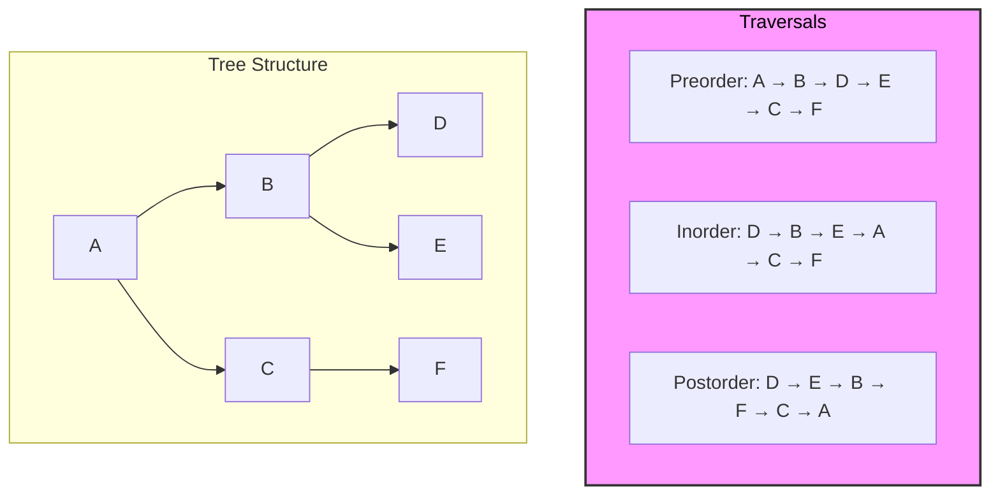

## What are Trees

- Node based data structure which has a value and children.
- Children are nodes themselves, which makes a hierarchical structure.

## Tree Types

| Tree Type                | Description                                                      | Use Cases                                                                     |
| ------------------------ | ---------------------------------------------------------------- | ----------------------------------------------------------------------------- |
| Binary Tree              | Each node has at most 2 children                                 | Basic tree problems, expression trees                                         |
| Binary Search Tree (BST) | Left < Root < Right ordering maintained                          | Searching, insertion, deletion in O(log n) time if balanced                   |
| AVL Tree                 | Self-balancing BST (balance factor: -1, 0, 1)                    | Dynamic sorted data, indexing                                                 |
| Red-Black Tree           | Self-balancing BST with color rules                              | Used in many STL libraries (e.g., `std::map`, `std::set` in C++)              |
| Segment Tree             | Binary tree for range queries and updates                        | Range minimum/maximum/sum queries, competitive programming                    |
| Fenwick Tree (BIT)       | Binary Indexed Tree for prefix sums                              | Range queries and updates, smaller and faster than segment tree in some cases |
| Trie (Prefix Tree)       | N-ary tree for storing strings/prefixes                          | Autocomplete, spell checker, IP routing                                       |
| N-ary Tree               | Each node can have N children                                    | General hierarchical data like file systems, JSON trees                       |
| B-Tree                   | Generalized BST used in databases                                | Database indexing, disk storage systems                                       |
| B+ Tree                  | Extension of B-Tree with all values in leaves                    | Range queries in databases, file systems (e.g., NFTS)                         |
| Heap (Binary Heap)       | Complete binary tree satisfying heap property (min/max)          | Priority queues, heap sort                                                    |
| Ternary Search Tree      | Trie-like structure with at most 3 children per node             | Memory-efficient string storage, autocomplete                                 |
| Suffix Tree              | Compressed trie of all suffixes of a string                      | String matching, pattern matching, bioinformatics                             |
| Interval Tree            | Tree storing intervals and allowing overlapping interval queries | Calendar systems, computational geometry                                      |
| K-D Tree                 | k-dimensional binary tree for spatial data                       | Nearest neighbor search, range queries in multi-dimensional data              |
| Merkle Tree              | Tree of hashes where each parent is hash of children             | Blockchain, secure data verification                                          |

### Terminologies

- Root: The most parent element.
- Height: Length between Root and Most childish Node.
- Binary Tree: Has Max of 2 Children
- Binary Search Tree: Has nodes in specific order (Pre/Post/Infix)
- Nodes: Any children at any level
- Leaf: Nodes without any children
- Balanced Tree: L&R subtree are of same height at any given level.
- Branching Factor: Amount of children a tree has.

## Tree Traversals



### DFS Tree Traversal (Preorder)

```ts
interface TreeNode<T> {
  value: T;
  left: TreeNode<T>;
  right: TreeNode<T>;
}

function walk<T>(currentNode: TreeNode<T>, path: TreeNode<T>[]) {
  // Base case, if we have a leaf node, we return.
  if (!currentNode) return;

  // Preorder: Current, Left, Right
  // Change the ordering for inorder and postorder
  path.push(currentNode); // Visit current node
  walk(currentNode.left, path); // Visit Left subtree
  walk(currentNode.right, path); // Visit Right subtree
}
```
## Breadth First Search in a Binary Tree

## Comparing 2 Trees
